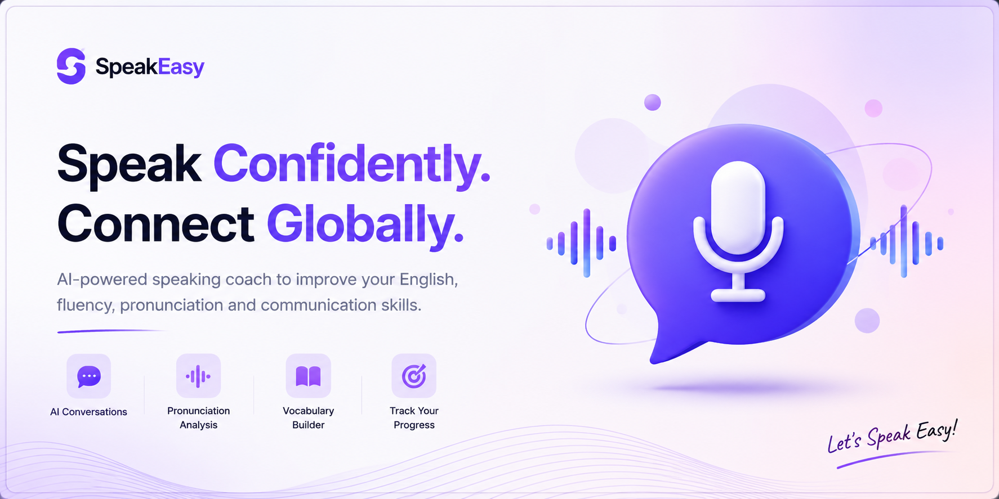
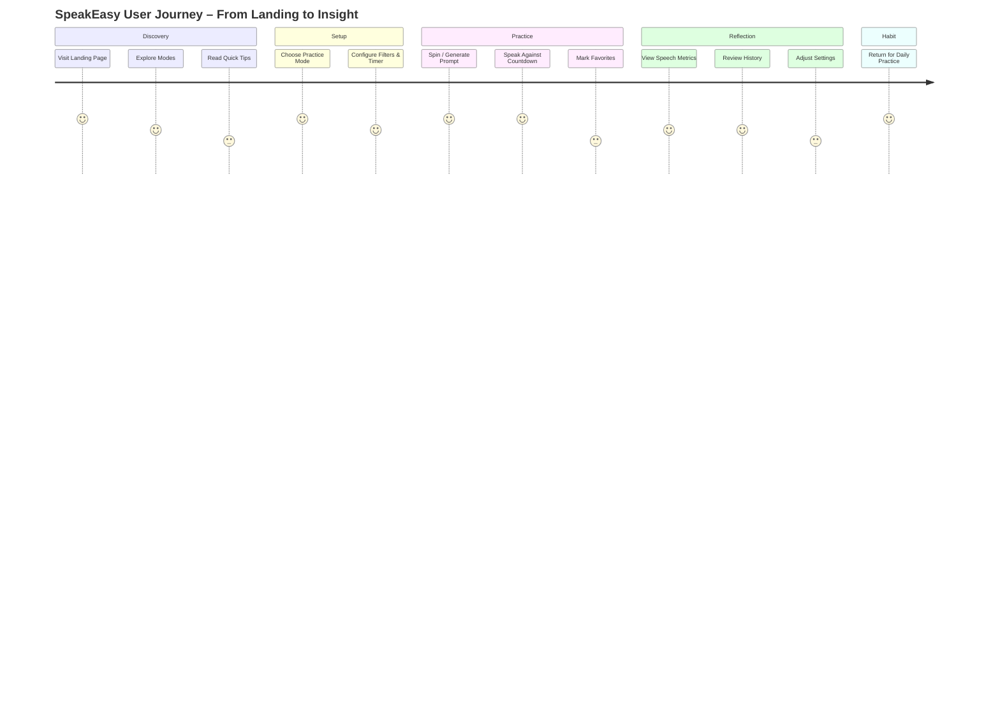
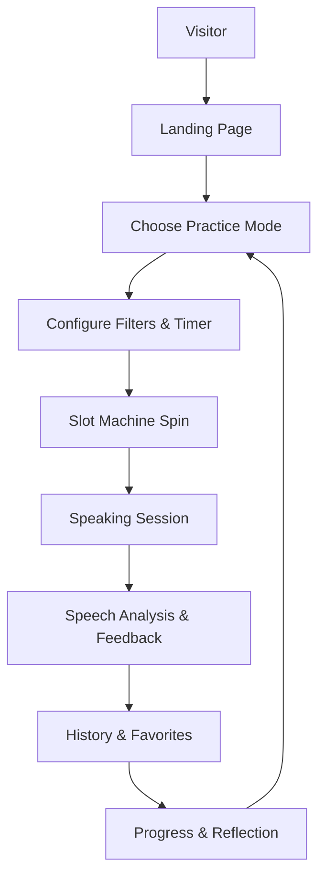
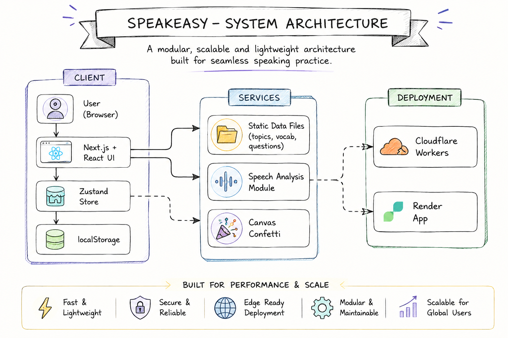
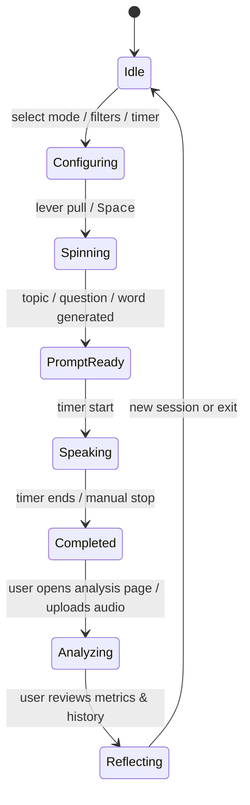
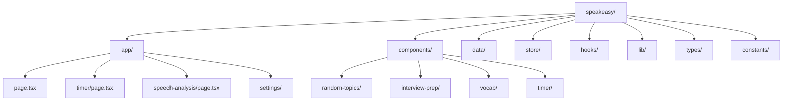
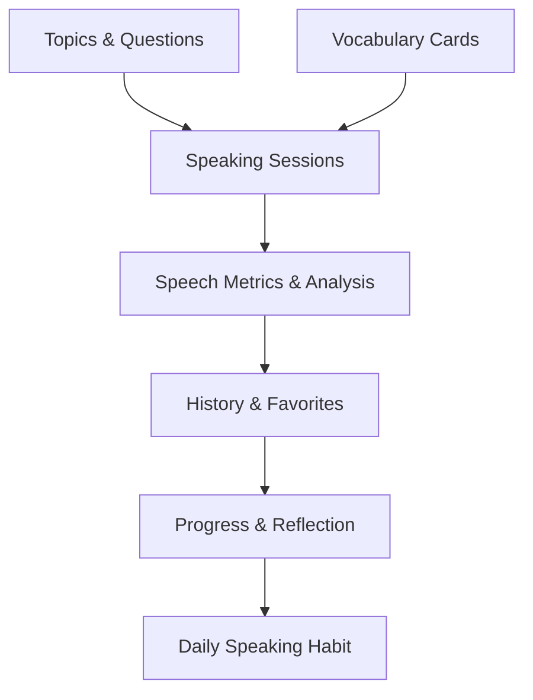
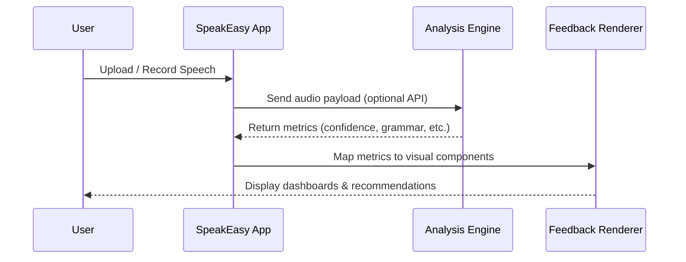
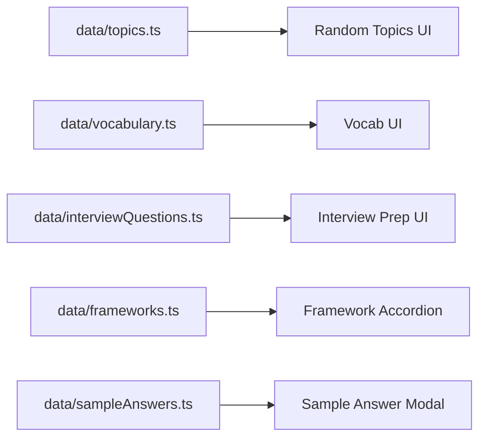
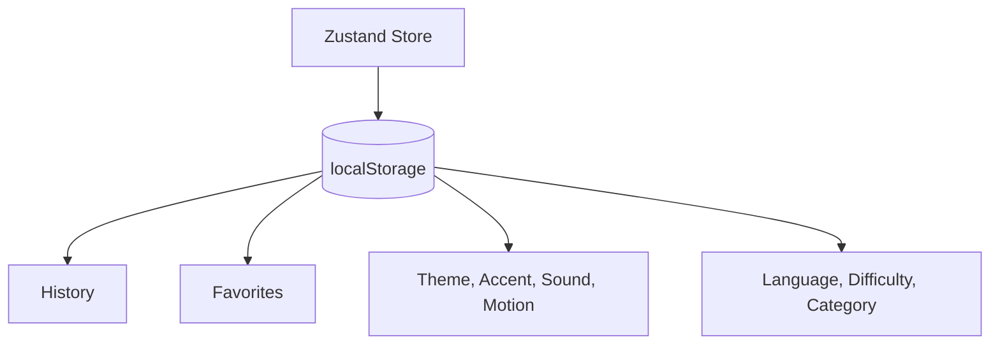

***

# 🎙️ SpeakEasy – AI-Driven Speaking Practice Studio

> **Sharpen your public speaking, interview skills, and vocabulary – one spin, one speech, one insight at a time.** 

<div align="center">

<!-- Core Identity -->

<a href="#-product-overview">
  
</a>

<br/>
<br/>


<br/>


</div>

***

<a id="top"></a>

## 🧭 Table of Contents

- [🎙️ SpeakEasy – AI-Driven Speaking Practice Studio](#-speakeasy--ai-driven-speaking-practice-studio)
- [🧭 Table of Contents](#-table-of-contents)
- [✨ Hero Section](#-hero-section)
- [📌 Product Overview](#-product-overview)
- [💡 Why SpeakEasy Exists](#-why-speakeasy-exists)
- [👥 Who Should Use This](#-who-should-use-this)
- [🚀 Key Feature Cards](#-key-feature-cards)
- [🧠 UX \& User Journey](#-ux--user-journey)
- [🏛 Architecture Overview](#-architecture-overview)
- [🧱 Technology Stack](#-technology-stack)
- [📁 Folder \& Module Architecture](#-folder--module-architecture)
- [⌨️ Keyboard Shortcuts](#%EF%B8%8F-keyboard-shortcuts)
- [🎨 Design System](#-design-system)
- [🖼 Preview \& Screenshots](#-preview--screenshots)
- [⚙️ Installation \& Setup](#%EF%B8%8F-installation--setup)
- [🔐 Environment Variables](#-environment-variables)
- [🔧 Configuration](#-configuration)
- [📚 Core Workflows \& Usage](#-core-workflows--usage)
- [🧬 AI \& Analysis Pipelines](#-ai--analysis-pipelines)
- [🔌 API \& Data Flows](#-api--data-flows)
- [🗄 Database \& Persistence](#-database--persistence)
- [📈 Performance \& Optimization](#-performance--optimization)
- [♿ Accessibility \& UX](#-accessibility--ux)
- [🛡 Security Considerations](#-security-considerations)
- [🌍 Deployment Guides](#-deployment-guides)
- [📅 Project Roadmap](#-project-roadmap)
- [🐛 Troubleshooting](#-troubleshooting)
- [❓ FAQ](#-faq)
- [📓 Changelog](#-changelog)
- [📄 License](#-license)
- [🙏 Acknowledgements](#-acknowledgements)
- [📬 Contact](#-contact)
- [⬆ Back to Top](#-back-to-top)

***

## ✨ Hero Section

> **Speak smarter, sound sharper, and feel more confident – in interviews, presentations, and everyday conversations.**

- **Live Demo:** https://speakeasy-kb02.onrender.com/
- **Primary modes:** Random Topics, Interview Prep, Vocabulary Builder. 
- **Design vibe:** Warm editorial aesthetic with cream background, deep forest accents, and cinematic motion. 

<div align="center">

> 🔊 **Slot-machine inspired speaking studio** – pull the lever, grab a topic, start talking, and get better every day. 

</div>

***

## 📌 Product Overview

### What problem does SpeakEasy solve?

Public speaking and interviews are hard because practice feels awkward, repetitive, and hard to structure. SpeakEasy removes friction by turning practice into a **game-like, guided speaking session** with curated topics, interview questions, and vocabulary prompts. 

Instead of staring at a blank page or generic prompt list, users get **highly contextual, filterable topics** and **structured answer frameworks** so practice is both fun and clinically useful. 

### How SpeakEasy works (high-level)

1. Choose a practice mode (Random Topics, Interview Prep, Learn Vocabulary). 
2. Pull the animated slot-machine lever or press keyboard shortcuts to generate content. 
3. Speak for a set duration using the integrated circular timer. 
4. Optionally upload or record speech and analyze metrics like confidence, grammar, and pacing. 
5. Save history and favorites, tweak design/system settings, and iterate daily. 

### Real-world applications

- 📢 Interview preparation for tech, product, and business roles.
- 🎤 Presentation dry-runs and pitch practice.
- 🗣 Language learning and accent improvement.
- 🧑‍🏫 Communication coaching and classroom exercises.
- 💼 Soft skills practice for campus placements and corporate training.

***

## 💡 Why SpeakEasy Exists

- **Confidence gap:** Many learners know theory but struggle to articulate ideas under pressure.
- **Practice gap:** Generic question lists and flashcards are not enough – users need structured, time-bound speaking reps.
- **Design gap:** Most speaking tools feel clinical; SpeakEasy is **editorial, warm, and delightful**, making practice something you actually look forward to. 

SpeakEasy aims to be the **“daily speaking studio”** for students, professionals, creators, and anyone who wants to sound more thoughtful, structured, and confident.

***

## 👥 Who Should Use This

- 🎓 **Students \& freshers** preparing for campus placements, GDs, HR rounds, and technical interviews.
- 👨‍💻 **Developers \& engineers** practicing system design, behavioral rounds, and on-the-spot questions.
- 🌍 **Language learners** building fluency, vocabulary, and pronunciation.
- 🧑‍🏫 **Trainers \& coaches** designing speaking drills and feedback workflows.
- 🧠 **Self-learners** interested in communication, storytelling, and public speaking practice.

***

## 🚀 Key Feature Cards

> Each feature is intentionally designed to support **speaking confidence, structure, and consistency**.


| Feature | Description |
| :-- | :-- |
| 🎙 **AI Speaking Practice** | Generate structured prompts, speak against a timer, and review your performance with a metrics dashboard. |
| 🎰 **Slot Machine Topics** | Pull the lever or press keyboard shortcuts to get curated speaking topics across 12+ categories and 13 languages.  |
| 🧠 **Interview Prep Studio** | Practice 100+ behavioral, leadership, communication, and technical questions with STAR/PREP/PPF frameworks.  |
| 📖 **Vocabulary Builder** | Learn 200+ words with definitions, pronunciation, examples, and speaking angles you can use instantly.  |
| ⏱ **Cinematic Timer** | Full-page circular countdown with animated progress ring, quick adjustments, and celebratory confetti.  |
| 📈 **Speech Metrics** | Analyze confidence, grammar, vocabulary richness, pacing, and more on the speech analysis page.  |
| ⭐ **History \& Favorites** | Persist last 100 generated items and favorites via Zustand + localStorage for consistent long-term practice.  |
| 🎨 **Personalized Studio** | Theme (dark/light/system), accent colors, sound \& motion toggles, and accessibility-friendly controls.  |
| ⌨️ **Keyboard-First UX** | Spin, switch modes, and close modals via keyboard for high-velocity practice sessions.  |
| 🌎 **Multi-language Topics** | Practice across multiple languages to improve fluency and cross-cultural communication.  |


***

## 🧠 UX \& User Journey

### High-level user journey




### Linear practice flow




***

## 🏛 Architecture Overview

> SpeakEasy is a **Next.js 16 + React 19** app with a curated data layer and client-side persistence via Zustand and localStorage, deployed to edge runtimes like Cloudflare Workers (and optionally Render). 

### Conceptual system architecture

<a href="#-Conceptual system architecture">
  
</a>


### Application lifecycle (state diagram)




***

## 🧱 Technology Stack

> **Core stack choices** prioritize **performance, smooth UX, and maintainable data-driven features.** 


| Area | Technology | Notes |
| :-- | :-- | :-- |
| Frontend Framework | **Next.js 16 (App Router)** | Routing, SSR/SSG, metadata, layouts.  |
| UI Runtime | **React 19** | Concurrent features, component composition.  |
| Language | **TypeScript 5** | Strict types for data and components.  |
| Styling | **Tailwind CSS v4** | Utility-first with custom tokens for editorial look.  |
| Animation | **Framer Motion 12** | Page transitions, slot lever gestures, micro-interactions.  |
| State Management | **Zustand 5** | Global app store + persistence to localStorage.  |
| Icons | **Lucide React** | Consistent, modern iconography.  |
| Effects | **canvas-confetti** | Celebratory feedback on timer completion.  |
| Deployment | **Cloudflare Workers + Render** | Edge-first deployment with optional traditional hosting.  |
| Data Layer | Static TS files | Topics, vocab, interview questions, frameworks.  |
| Storage | Browser localStorage | History, favorites, settings, filters.  |
| Monitoring | (Pluggable) | Add tools like Logflare / Sentry / Analytics as needed. |
| Testing | (Optional) Jest/Testing Library | Recommended for component and flow tests. |
| Package Manager | pnpm / npm / yarn | Any modern package manager supported. |


***

## 📁 Folder \& Module Architecture

> The project follows a **feature-focused structure** to keep speaking, interview, vocab, and timer concerns well-separated. 

```bash
speakeasy/
├── app/
│   ├── layout.tsx              # Root layout, providers, SEO scaffolding[file:1]
│   ├── page.tsx                # Home page with 3-tab editorial layout[file:1]
│   ├── timer/page.tsx          # Circular countdown timer screen[file:1]
│   ├── speech-analysis/page.tsx# Speech analysis dashboard[file:1]
│   ├── confidence/             # Confidence-focused flows
│   ├── fluency/                # Fluency practice routes
│   ├── daily-routine/          # Routine practice & streaks
│   ├── learn/                  # Learning-related sections
│   ├── profile/                # User profile shell (for future auth)
│   ├── progress/               # Progress & summaries
│   └── settings/               # Design & UX configuration[file:1]
├── components/
│   ├── layout/                 # FloatingNav, EditorialPanels, FloatingActions[file:1]
│   ├── random-topics/          # SlotMachineCard, Lever, TopicFilters[file:1]
│   ├── interview-prep/         # FrameworkAccordion, SampleAnswerModal[file:1]
│   ├── vocab/                  # VocabCard, VocabPanel[file:1]
│   └── timer/                  # TimerModal, CircularTimer[file:1]
├── data/
│   ├── topics.ts               # 100+ topics (category/difficulty/language)[file:1]
│   ├── vocabulary.ts           # 200+ vocab words[file:1]
│   ├── interviewQuestions.ts   # 100+ interview questions[file:1]
│   ├── frameworks.ts           # STAR, PREP, PPF definitions[file:1]
│   └── sampleAnswers.ts        # Structured sample answers[file:1]
├── store/
│   └── appStore.ts             # Zustand store persisted to localStorage[file:1]
├── hooks/
│   └── useSound.ts             # Sound effect hooks[file:1]
├── lib/
│   └── utils.ts                # Common helpers[file:1]
├── types/
│   └── index.ts                # Shared TypeScript types[file:1]
└── constants/
    └── index.ts                # Design tokens & app constants[file:1]
```


### Folder architecture diagram




***

## ⌨️ Keyboard Shortcuts

> SpeakEasy is optimized for **keyboard-first workflows** so you can stay in flow while practicing. 


| Shortcut | Action |
| :-- | :-- |
| <kbd>Space</kbd> | Spin / generate new content in the current mode.  |
| <kbd>Ctrl</kbd> + <kbd>1</kbd> | Switch to **Random Topics** tab.  |
| <kbd>Ctrl</kbd> + <kbd>2</kbd> | Switch to **Interview Prep** tab.  |
| <kbd>Ctrl</kbd> + <kbd>3</kbd> | Switch to **Learn Vocab** tab.  |
| <kbd>Esc</kbd> | Close active modal / dialog.  |

> 💡 **Tip:** Use keyboard shortcuts and the timer together to simulate real interview conditions.

***

## 🎨 Design System

> SpeakEasy uses a **small, opinionated token set** to deliver a recognizable editorial brand. 


| Token | Value | Usage |
| :-- | :-- | :-- |
| `background` | `#F9F5EB` | Warm cream canvas.  |
| `primary` | `#134F43` | Deep forest green for core actions.  |
| `accent` | `#E8A23B` | Warm golden amber for highlights and CTAs.  |
| `secondary` | `#b8a8d4` | Soft lavender used in lever and timer ring.  |
| `fontHeading` | Cormorant Garamond | Serif editorial headings.  |
| `fontBody` | Inter | Clean sans-serif body text.  |

> 🎨 **Brand Notes:** The combination of serif headings and sans body creates a **magazine-like reading experience** while keeping the app modern. 

***

## 🖼 Preview \& Screenshots

> Replace the following placeholders with actual assets from your `.github/assets` or `public/` folder.

### Landing \& Dashboard

- 
- 


### Conversation \& Practice

- 
- 
- 


### Analytics \& Settings

- 
- 
- 


### Mobile \& Dark Mode

- 
- 

***


***

## 📚 Core Workflows \& Usage

### 1. Random Topics (Speaking Practice)

1. Go to the **Random Topics** tab.
2. Choose **language**, **difficulty**, and **category** using filters. 
```
3. Pull the lever or press <kbd>Space</kbd> to spin. 
```

4. Speak about the generated topic against the countdown timer.
5. Save interesting topics to **Favorites** and review them later. 

### 2. Interview Prep

```
1. Switch to **Interview Prep** using the tab or <kbd>Ctrl</kbd> + <kbd>2</kbd>. 
```

2. Pick a question type: Behavioral, Leadership, Communication, Technical. 
3. Use **STAR/PREP/PPF** accordions to structure your answer. 
4. Optionally open the **Sample Answer Modal** to see structured examples. 
5. Practice out loud with the timer and refine your story each iteration. 

### 3. Vocabulary Builder

1. Navigate to **Learn Vocab**. 
2. Browse or filter words by difficulty and language. 
3. Review definitions, pronunciation, example sentences, and speaking angles. 
4. Use the timer to practice using the word in multiple sentences or micro-stories.
5. Mark words as favorites to revisit them during future sessions. 

### 4. Timer-Only Sessions

- Visit `/timer` for a **focused countdown experience**. 
- Adjust time via `−0:30` / `+0:30` buttons. 
- Start, pause, and reset sessions; enjoy confetti on completion. 


### 5. Speech Analysis

- Open `/speech-analysis` from navigation. 
- Upload or record audio (depending on implementation).
- View metrics such as confidence, grammar, vocabulary, and pacing. 
- Use insights to adjust your next practice block.

***

## 🧬 AI \& Analysis Pipelines

> While much of SpeakEasy is **data-driven and client-side**, the analysis and feedback layers can be powered by AI services where available.

### Learning pipeline




### AI response pipeline (conceptual)




***

## 🔌 API \& Data Flows

> Current implementation emphasizes **static data files** and **client-side flows**; APIs are primarily relevant when integrating external analysis or auth. 

### Data flow diagram



> 📌 **Note:** Because most content is stored in `data/` files, deployments are **stateless** and easy to scale across environments. 

***

## 🗄 Database \& Persistence

> SpeakEasy currently leans on **browser storage** to keep the experience lightweight and offline-friendly. 

### Persistence model



> 🧠 **Idea:** If you later move to a server-backed database (PostgreSQL, MongoDB, etc.), you can map these keys to tables like `sessions`, `favorites`, `settings` while maintaining the same store shape.

***

## 📈 Performance \& Optimization

Key performance strategies:

- **Static data files** for topics, vocabulary, and interview questions avoid runtime queries. 
- **Client-side state + localStorage** means most interactions are instant and offline-tolerant. 
- **Framer Motion** animations are scoped to key interactions to avoid layout thrash. 
- **Edge-friendly deployment** (Cloudflare Workers) reduces latency for global users. 

Recommended optimizations:

- Code-split heavy pages like speech analysis.
- Lazy-load audio and visualization modules.
- Use image optimization in Next.js for screenshots and assets.
- Add caching headers for static assets behind your deployment platform.

***

## ♿ Accessibility \& UX

Accessibility-friendly features:

- **Reduced motion toggle** to accommodate motion sensitivity. 
- **Sound toggle** for quiet environments. 
- Legible typography pairing (Cormorant + Inter) and high-contrast brand colors. 
- Clear focus states and keyboard-first controls.

> ✅ **Goal:** Make speaking practice inclusive for users across devices, environments, and accessibility needs.

***

## 🛡 Security Considerations

Even for a primarily client-side application:

- Avoid storing sensitive PII in localStorage.
- Validate any user input that reaches APIs (if added).
- Use HTTPS-only deployments.
- Configure CORS appropriately for any backend endpoints.
- If authentication is introduced, follow best practices for session management, CSRF protection, and cookie security.

***


## 📅 Project Roadmap

> This roadmap is provided as a **GitHub-friendly checklist**; adapt statuses as your project evolves.

### Completed

- [x] Random Topics mode with filters.
- [x] Interview Prep with STAR/PREP/PPF frameworks. 
- [x] Vocabulary builder with curated word list. 
- [x] Circular countdown timer with confetti. 
- [x] Dark/Light/System theme \& accent color picker. 
- [x] History \& Favorites with localStorage persistence. 
- [x] Speech Analysis page \& metrics dashboard. 


### In Progress

- [ ] Deeper speech analysis leveraging AI services.
- [ ] Enhanced progress dashboards and streaks.
- [ ] Multi-user profiles and authentication.
- [ ] Improved mobile-first layouts and gestures.


### Planned

- [ ] Leaderboards and community challenges.
- [ ] Guided speaking paths (learning journeys).
- [ ] Multi-device sync and cloud-backed storage.
- [ ] Rich analytics export and coaching tools.


### Future Ideas

- [ ] Live practice sessions with peers or mentors.
- [ ] Integrations with calendar/task tools for scheduled practice.
- [ ] Smart topic recommendations based on past sessions.

***

## 🐛 Troubleshooting

Common issues \& hints:

1. **Keyboard shortcuts not working**
    - Ensure focus is inside the main app window.
    - Check that custom keybindings aren’t overridden by browser extensions.
2. **Sound effects not playing**
    - Verify system sound is enabled and the **Sound toggle** in settings is on. 
    - Check browser autoplay policies; user interaction may be required.
3. **Timer not starting**
    - Confirm the timer duration is greater than zero.
    - Check console logs for any runtime errors.
4. **History or favorites not persisting**
    - Confirm browser allows localStorage. 
    - Try disabling private/incognito mode for persistence.
5. **Speech analysis metrics not updating**
    - Ensure audio recording/upload works in your browser.
    - If using external APIs, verify API keys and network connectivity.

***

## ❓ FAQ

> Expand the questions below to understand how SpeakEasy fits into different workflows.

<details>
<summary><b>1. Is SpeakEasy only for English?</b></summary>

No. Topics and vocabulary can be curated across **13+ languages**, and you can extend the data files to support more language-specific prompts. 
</details>
<details>
<summary><b>2. Does SpeakEasy store my recordings?</b></summary>

By default, SpeakEasy focuses on **client-side practice**; any storage of recordings depends on your integration with external services or backends.
</details>
<details>
<summary><b>3. Can I use this for campus placements?</b></summary>

Yes. Interview Prep mode is particularly useful for behavioral and technical questions common in campus placements and early-career roles. 
</details>
<details>
<summary><b>4. How is this different from normal flashcards?</b></summary>

SpeakEasy combines curated prompts with **timed speaking sessions**, **structured frameworks**, and **speech metrics**, making practice closer to real-world scenarios. 
</details>
<details>
```
<summary><b>5. Do I need an account to use it?</b></summary>
```

Current flows work without authentication; user-facing profile and progress routes can evolve into account-based features later. 
</details>
<details>
```
<summary><b>6. Is it mobile-friendly?</b></summary>
```

The layout is designed to be responsive; use the mobile preview screens and test across devices to ensure a smooth experience.
</details>
<details>
<summary><b>7. Can coaches use SpeakEasy with their students?</b></summary>

Yes. Coaches can design practice templates using topics, vocab, and timers, then ask students to record and analyze sessions.
</details>
<details>
<summary><b>8. Which browser is recommended?</b></summary>

Modern Chromium-based browsers (Chrome, Edge, Brave) and Firefox work best; ensure audio permissions are granted.
</details>
<details>
<summary><b>9. How do I add new topics or vocab?</b></summary>

Edit `data/topics.ts` and `data/vocabulary.ts`; keep the schema consistent with existing entries for seamless integration. 
</details>
<details>
<summary><b>10. Can I change the design system?</b></summary>

Yes. Update Tailwind configuration and `constants/index.ts` to adjust colors, typography, and spacing. 
</details>
<details>
<summary><b>11. Is there a dark mode?</b></summary>

Yes. SpeakEasy supports **Dark / Light / System** theme toggles via settings. 
</details>
<details>
<summary><b>12. How does the timer work?</b></summary>

A circular SVG progress ring animates over time, with quick adjustments and confetti on completion for positive reinforcement. 
</details>
<details>
<summary><b>13. Where are favorites stored?</b></summary>

Favorites and history are stored in `localStorage` via the Zustand app store. 
</details>
<details>
<summary><b>14. Can I integrate external speech APIs?</b></summary>

Yes. You can add `/api` routes or Workers that process audio and return metrics, then plug them into the analysis page.
</details>
<details>
<summary><b>15. Does it support multiple difficulty levels?</b></summary>

Yes. Topics and vocab can be filtered by **Easy / Medium / Hard** difficulty. 
</details>
<details>
<summary><b>16. How do I reset settings?</b></summary>

Provide a “Reset to defaults” action in the Settings page tied to the app store; currently, settings can be manually adjusted. 
</details>
<details>
<summary><b>17. Can this run offline?</b></summary>

Core flows (topics, vocab, timer) can work in offline mode thanks to static data and localStorage; audio analysis may require connectivity.
</details>
<details>
```
<summary><b>18. Is the project open-source?</b></summary>
```

The project is **source-private**, but the deployed application is publicly accessible. 
</details>
<details>
<summary><b>19. How do I contribute ideas if source is private?</b></summary>

You can open issues, share feedback, or reach out via contact channels listed below; maintainers can incorporate suggestions.
</details>
<details>
<summary><b>20. Will there be mobile apps?</b></summary>

This README focuses on the web app; a mobile app roadmap can be explored in the future based on demand.

</details>

***

## 📓 Changelog

> Use this section to track key releases; replace placeholder entries with real tags and dates.

- `v1.0.0` – Initial release with Random Topics, Interview Prep, Vocabulary Builder, Timer, Settings, and Speech Analysis. 
- `v1.1.0` – Planned: Enhanced metrics, new topic packs, and improved progress screens.
- `v1.2.0` – Planned: Authentication, multi-user progress tracking, and coach tooling.

***

## 📄 License

This project is **source-private**. The deployed application is publicly accessible for use. 
Unauthorized copying, modification, or redistribution of the source code is **not permitted**. 

> 🔒 **Note:** Treat this repository as a **closed-source product** with a public demo; reach out if you need access or collaboration.

***

## 🙏 Acknowledgements

- Inspiration from **slot-machine UI patterns** and editorial-style web experiences. 
- Open-source libraries: Next.js, React, TypeScript, Tailwind CSS, Framer Motion, Zustand, Lucide React, canvas-confetti, and others in your dependency tree. 
- Communication frameworks: STAR, PREP, PPF and classic interview preparation literature.

***

## 📬 Contact

> Add your real links here to make this README recruiter-friendly.

- GitHub: `https://github.com/ASLAM-byte`
- LinkedIn: `https://linkedin.com/in/ASLAM-byte`
- Website: `https://speakeasy-kb02.onrender.com/`

***

